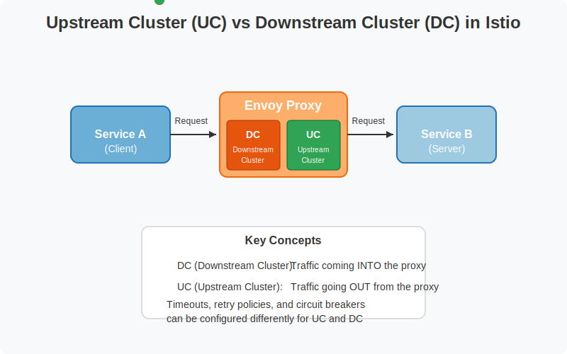

## Understanding 503'er in Istio

**Downstream Cluster (DC)**

* Represents traffic coming into the Envoy proxy
* The "client side" of the connection
* Typically from an end user or another service making requests
* Configured with listener configs and HTTP route configurations

**Upstream Cluster (UC)**

* Represents traffic going out of the Envoy proxy
* The "server side" of the connection
* Directs traffic to the actual service instances
* Configured with cluster definitions in DestinationRules


### Downstream Cluster (DC) Idle Timeout

**NOTE:** [https://istio.io/latest/docs/reference/config/networking/destination-rule/#ConnectionPoolSettings-HTTPSettings](Sidecar HTTPSettings for inboundConnectionPool)


```yaml
# An example of a mesh-wide Sidecar that redefines the idle/keep-alive timeout for the inbound clusters of all Envoys
apiVersion: networking.istio.io/v1
kind: Sidecar
metadata:
  name: default
  namespace: istio-system
spec:
  inboundConnectionPool:
    http:
      # Configure a Sidecar inbound cluster HTTP Keep-Alive timeout
      # of 15 minutes. It must be ensured that the HTTP server of the main
      # container has a strictly HIGHER/GREATER value than this.
      # The idle timeout for upstream connection pool connections. The idle timeout is defined as the period in which there are no active requests. If not set, the default is 1 hour.
      idleTimeout: 15m
```

**OR**

```yaml
# application specific sidecar to configure idle Timeout
apiVersion: networking.istio.io/v1
kind: Sidecar
metadata:
  name: nginx
  namespace: default
spec:
  inboundConnectionPool:
    http:
      # Configure a Sidecar inbound cluster HTTP Keep-Alive timeout
      # of 15 minutes. It must be ensured that the HTTP server of the main
      # container has a strictly HIGHER/GREATER value than this.
      # The idle timeout for upstream connection pool connections. The idle timeout is defined as the period in which there are no active requests. If not set, the default is 1 hour.
      idleTimeout: 15m
  workloadSelector:
    labels:
      app: nginx
```

### Upstream Cluster (UC) Idle Timeout

```yaml
apiVersion: networking.istio.io/v1
kind: DestinationRule
metadata:
  name: nginx
spec:
  host: nginx.default.svc.cluster.local
  trafficPolicy:
    connectionPool:
      http:
        idleTimeout: 15m
```

**NOTE:** **adjust keep-alive timeout (higher than Sidecar, DestinationRule) in the language specific application code(java, python, nodejs...)**

```bash
# Reference: https://github.com/istio/istio/pull/52055
pilot:
  env:
    # 1.24 behavioral changes
    ENABLE_INBOUND_RETRY_POLICY: "true"
```

### Mesh-wide globally `defaultHttpRetryPolicy`
```yaml
# Reference: https://github.com/istio/istio/pull/52055#issuecomment-2620256624
meshConfig:
  defaultHttpRetryPolicy:
    attemps: 2
    perTryTimeout: 5s
    retyOn: "reset-before-request,connect-failure,refused-stream"
```

### References:
* [Upstream connection error 503 in Istio](https://karlstoney.com/istio-503s-ucs-and-tcp-fun-times/)
* [Analysis of 503 Error(SOLVED)](https://github.com/istio/istio/issues/55138)
* [GH Issue: Implement retry on connection reset to upstream](https://github.com/istio/istio/issues/51704)
   * [comment](https://github.com/istio/istio/issues/51704#issuecomment-2188555136)
* [Implementation of default inbound policy](https://github.com/istio/istio/pull/52055)